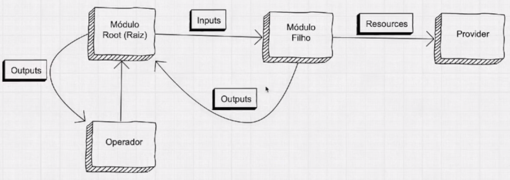

# 1 - Módulos 

Link da doc oficial: https://terraform.io/docs/configuration/modules.html

## 1.1 - Introdução
Módulos são uma forma de organizar melhor o código. Existem módulos root e filhos. O módulo root deve ficar na raiz do projeto. Os módulos filhos devem ser segregados em subdiretórios.

É uma forma de reunir configurações e melhor organizar o código feito para usar no Terraform. É possível fornecer um módulo para outras pessoas o utilizarem.

Pode-se fazer uma analogia à uma classe em POO.

## 1.2 - Tipos de Módulos
Existem os módulos definidos em um diretório do código e os root modules.

Qualquer arquivo que não se define a utilização de modules, ele é um root modules. 

Existem Child Modules também. Observe o diagrama abaixo:


**Inputs**: São entradas que são fornecidas aos módulos. Por exemplo, uma variável.
**Outputs**: São retornos que os módulos fornececem.

Módulos filhos (child modules) não fornecem outputs para o operador, apenas para o módulo raiz.

## 1.3 - Criando um módulo
Na raiz do projeto, ao se criar um diretório e colocar arquivos .tf dentro dela, teremos um módulo. Essa é uma maneira mais simples de se criar.

As informações mais elementares do projeto como providers e sobre o terraform, como por exemplo, o backend, é recomendado que estejam no root module, ou seja, na raiz do projeto.

Na aula, convencionou-se a utilizar o nome main.tf para o root module, mas poderia ser qualquer nome.

## 1.4 - Chamando um módulo filho
Para chamar um módulo filho basta utilizar o module block, conforme abaixo:
```javascript class:"lineNo"
1 module "server" {
2   source = "./path-to-module"
3   servers = 5
4 }
```
Na linha 1 é criado o bloco e nomeado ("servers"), poderia ser qualquer nome.
Na linha 2 é indicado em "source" o path de onde está o módulo
Existem outros tipos de sources.
Na linha 3 é um exemplo de um input. Tudo que está no bloco module além de source, version e providers, normalmente são inputs.
No módulo, pode-se definir uma variável, como por exemplo a "servers". Isso pode ser feito em um arquivo variables.tf dentro do módulo:
```javascript
//Arquivo variables.tf, dentro do módulo filho
variable "servers" {
}
```
Como não foi especificado nada como valor default, o operador será obrigado a fornecer um valor para servers.

#### 1.4.1 - Outputs de módulos filhos
Se existir um output configurado em um módulo filho, conforme já foi mencionado, ele não é exibido para o operador.
Para exibir, é necessário no module root chamar o output do child module. Por exemplo:
**Output no Child:**
```javascript
output "public_dns" { 
  value = aws_instance.web[*].public_dns
}
```
**Chamando o output do child module no root:**
```javascript
output "public_dns-us-east-1" { 
  value = module.servers.public_dns
}
```
Para chamar, coloca-se module.NOME_DO_MODULO.NOME_DO_OUTPUT

## 1.5 - Providers within Modules
Isso permite que determinado módulo que está sendo chamado, utilize um provider diferente.
Existem duas formas de fazer isso: a forma implicita e a explicita.
Na implicita não se define nada, já temos um provider sem alias e aplica no módulo.
Na explicita, é especificado no módulo a configuração de um provider, por exemplo:
```javascript
module "servers" {
    source = "./servers"
    servers = 1
    providers = {
        aws = "aws.usw2"
    }
}
```
O usw2 foi definido anteriormente no module root como um alias para outra região da aws.

### 1.6 - Multiplas instâncias de um Módulo
É possível no mesmo arquivo ter mais de uma vez o mesmo source para o mesmo módulo, devendo apenas terem nomes diferentes e inputs também.

## 2 - Backend
Link da doc oficial: https://terraform.io/docs/backends/index.html

### 2.1 - Introdução
O backend é a forma como o Terraform determina o estado (state). O state pode ser local ou remoto.

### 2.2 - Configuração do backend
A configuração do backend é opcional. Essa configuração é feita no bloco terraform:
```javascript
terraform {
    backend "s3" {
        ...
    }
}
```
Existem vários backends, no código acima foi ilustrado o s3 da aws, ou seja, um state ou backend remoto.
Sempre após a primeira configuração é importante executar o terraform init.
Na configuração do backend nem tudo é necessário ser colocado, alguns podem ser passados de forma interativa, via variável de ambiente, via arquivos de configuração local, dentre outros.
As configurações variam de backend para backend, ou seja, o s3 tem configurações diferentes do consul.

### 2.3 - State Storage
O state storage é um json onde é armazenado o state, seja o state local ou remoto.
#### 2.3.1 - Pegando o state
Através do comando abaixo:
```sh
terraform state pull > meu_backend.tfstate
```
O terraform "baixa" as informações do arquivo de state e coloca em um arquivo local.

### 2.4 - State Locking
Alguns backends tem suporte ao locking e outros não. O s3 tem suporte.
O state locking é uma funcionalidade que dá um lock, não permitindo fazer escrita no arquivo de state. Isso pode ser necessário quando duas ou mais pessoas estão utilizando o mesmo arquivo de estado.

#### 2.4.1 - Configurando o State Locking
No caso do s3, isso é feito com a utilização do dynamodb. É necessário, portanto, uma instância do DynamoDB (NoSQL).
Depois de criada a instância do DynamoDB, basta adicionar a configuração no backend, bloco terraform:
```yaml
dynamodb_table = "nome da tabela"
```
Ao criar o recurso do dynamodb na aws é necessário ter os atributos abaixo:
```yaml  
  attribute {
    name = "LockID"
    type = "S"
  }
```
Sempre que se muda algo no state ou backend, é necessário realizar novamente um terraform init.

É possível ignorar o lock passando na linha de comando do terraform a opção -lock=false. Exemplos:
```bash
terraform plan -out plano.plan -lock=false
terraform apply -lock=false "plano.plan"
```

## 3 - State
Link da doc oficial: https://terraform.io/docs/state/index.html

### 3.1 - Introdução
O state é o arquivo e estado, conforme já mencionado. Nele são guardadas as informações do que já está configurado no provider.
O arquivo de state tem a extensão .tfstate, em formato json.
O terraform não funciona sem state. O state mapeia o mundo real. Entende-se por mundo real os recursos que estão na cloud, no provider.

Além das informaçõe dos recourses do cloud provider, o arquivo de state também armaezana uma série de metadados que ajudam, por exemplo, a criar dependências entre recursos, como por exemplo, que um determinado recurso depende de outro.

### 3.2 - Performance
Adicionalmente o state pode realizar um cache de informações da cloud.
Por padrão, quando executamos um plan e/ou um apply, o terraforma consulta a cloud para sincronizar os recursos que já estão lá. Isso para infraestrutura pequena, não tem muito impacto. O terraform então atualiza o arquivo de state antes de rodar de fato o plan ou apply.

Para infraestruturas maiores, esse update no state, pode ser prejudicial para a performance.
Para evitar o problema de refresh de state antes do plan ou apply, basta adicionar no comando o parâmetro "-refresh=false".

Existe também a opção apenas de executar um refresh. Isso é necessário para atualizar o mundo real, do que está na cloud, para o arquivo de state. Vamos supor que alguém acessou a console da AWS e mudou uma tag de uma VM. Esse recurso está no state, mas não com a nova tag. Ao executar o refresh, o terraform vai no provider e atualiza informações que possam está em desacordo com o state.
```bash
terraform refresh
```
### 3.3 - State avançado
Não é recomendado manipular o arquivo state file de forma manual. Para manipular o state file, existe um comando apropriado.
```bash
terraform state <subcomando> [options] [args]
```
Cada manipulação do state file, o terraform cria um backup de forma automática.

Para listar todos os recursos do state:
```bash
terraform state list
```
Para movimentar/renomear um recurso:
```bash
terraform state mv aws_instance.web aws_instance.web2
```
Ao se utilizar o mv, há de ter atenção. No exemplo acima, foi renomeado o recurso web para web2 no arquivo de state. Ao executar o plan, o que vai ocorrer?
Como o web2, não existe no arquivo em código, o web2 não existe, ele vai ser destruído. Sempre quando redamos o plan, ele le o arquivo yaml e compara com o state file.

Para remover um recurso:
```bash
terraform state rm [options] ADDRESS
```
Ao utilizar o rm, ele retira o recurso do state file. Ao executar um plano, ele vai criar uma nova instance, a mesma que foi removida do state file, pois continua codada no arquivo yaml. Conclui-se que a instância que foi removida do state file, vai continuar no ar no cloud provider.

### 3.4 - Importando recursos
É possível importar recursos que já existem no cloud provider. Essa importação é apenas para colocar no state, não gera código yaml.

Link da documentação: terraform.io/docs/import/usage.html

Para rodar, execute:
```bash
terraform import aws.instance.example i-abc1234
```
No exemplo acima, após o import é passado o tipo "aws.instance" que será importado em um recurso com o nome "exemplo" no state file e o identificador "i-abc1234".

Ainda no exemplo acima, foi ilustrado uma importação simples.

Exsite também importações complexas, quando recursos tem outros recursos como dependência. Nesse caso, há de se avaliar sempre.

### 3.5 - Workspaces

Link da doc: https://terraform.io/docs/state/workspaces.html

Um workspace é uma forma de segregar state files.
Por exemplo, podemos ter um workspace para prd, dev e hml (ambientes).

Quando não se cria workspaces, o padrão é o default.
È preciso validar antecipadamente se o backend utilizado tem suporte a workspace, no caso o S3 tem.
```bash
terraform workspace new bar
```
Acima foi criado um workspace chamado bar. O workspace é a nível de state.

### 3.6 - Dados sensíveis no state file
É um erro comum, commitar o state file em um github. Muitas vezes, tem senhas e credenciais lá. Cuidado com isso!
O ideal é usar um backend remoto, como por exemplo, um S3.
Mas ainda com o S3, é ideal colocar encriptação nele. Para isso, basta adicionar uma configuração adicional no backend:
encrypt = true

